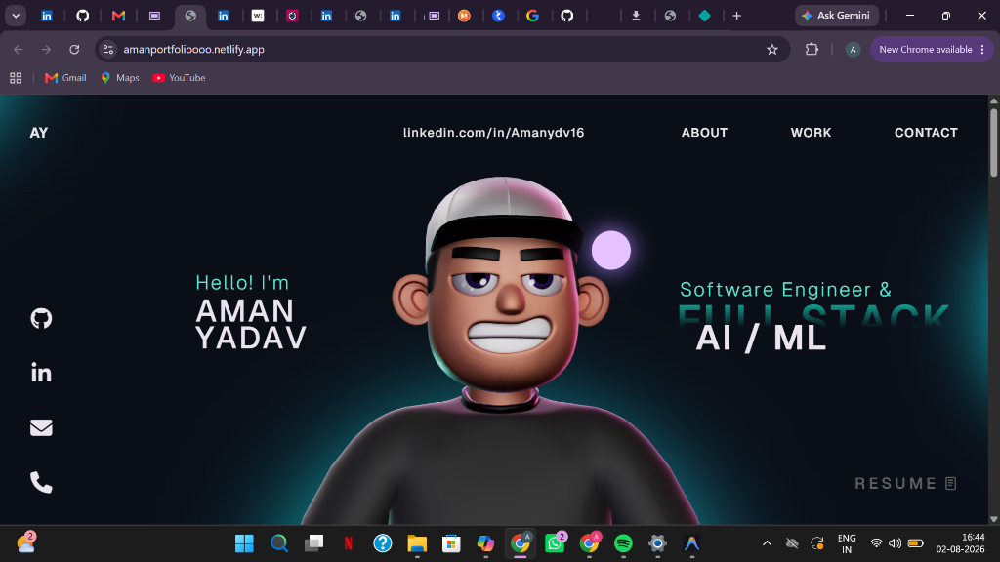

# Aman Yadav — 3D Developer Portfolio

This repository contains the source code for **Aman Yadav's** personal 3D developer portfolio built with React 18, TypeScript, Three.js, React Three Fiber, and GSAP. It features interactive 3D models, smooth section animations, project showcases, and a clean professional experience timeline.

Live Website: [https://amanportfolioooo.netlify.app/](https://amanportfolioooo.netlify.app/)  
Repository: [https://github.com/Amanydv16/Updated-Portfolio](https://github.com/Amanydv16/Updated-Portfolio)



---

## Highlights & Featured Sections

- **Landing Section**: Dynamic headline with animated roles (`AI / ML` & `Full Stack`).
- **About Me**: Professional summary highlighting 9+ months of internship experience in Full-Stack Development, Machine Learning, and Data Analytics, along with B.Tech CSE (AI/ML) at VIT Bhopal University (CGPA 9.03/10).
- **What I Do**: Full-Stack & Backend Engineering (Python, Django, Node.js, FastAPI, REST APIs, SQL, AWS, Docker) and AI/ML (TensorFlow, OpenCV, LLMs, RAG, LangChain, Analytics).
- **Work / Projects Carousel**:
  - **Beatwell-AI**: AI-Driven Heart Disease Prediction System (94% accuracy, 1,000+ active users) with custom dark UI showcase.
  - **GesturEase**: Computer vision real-time gesture recognition system (95% accuracy, 40% accessibility boost) with real-time hand-landmark tracking UI.
- **Experience Timeline**:
  - **Monetunes** | Full Stack Software Engineer (Aug 2026 – Present)
  - **Songdew** | Full Stack Intern (Jun 2026 – Jul 2026)
  - **Instahyre** | Full Stack Intern (Feb 2026 – Apr 2026)
  - **Indian Oil Corporation Ltd.** | Software Engineering Intern (Nov 2025 – Feb 2026)
  - **VIT Bhopal University** | B.Tech CSE (AI/ML) (Aug 2022 – Jun 2026)
- **Interactive Tech Stack**: 3D interactive floating physics spheres for skills (React, Node, Python, MySQL, MongoDB, TypeScript, etc.).
- **Resume & Contact**: Direct access to official resume (`Aman_Yadav_Resume.pdf`), GitHub, LinkedIn, Email, and Phone.

---

## Tech Stack

### Core Frameworks
- **React 18**
- **TypeScript**
- **Vite**

### 3D & Animation
- **Three.js**
- **@react-three/fiber**
- **@react-three/drei**
- **@react-three/rapier** (3D physics)
- **GSAP** + **@gsap/react** (ScrollSmoother, ScrollTrigger, SplitText)

### UI Icons & Components
- **react-icons**
- **react-fast-marquee**

---

## Getting Started

### Prerequisites

- **Node.js**: v18+ recommended
- **npm**: v9+ recommended

### Installation

1. Clone the repository:
   ```bash
   git clone https://github.com/Amanydv16/Updated-Portfolio.git
   cd Updated-Portfolio
   ```

2. Install dependencies:
   ```bash
   npm install
   ```

3. Run the development server:
   ```bash
   npm run dev
   ```

4. Open `http://localhost:5173/` in your browser.

---

## Available Scripts

- `npm run dev`: Launches local development server with Vite.
- `npm run build`: Type-checks (`npx tsc -b`) and builds production output in `dist/`.
- `npm run preview`: Serves production build locally for verification.

---

## Contact & Connect

- **Name**: Aman Yadav
- **Email**: [amanyadavji1616@gmail.com](mailto:amanyadavji1616@gmail.com)
- **Phone**: +91-8299572188
- **LinkedIn**: [linkedin.com/in/aman-ydvv16/](https://www.linkedin.com/in/aman-ydvv16/)
- **GitHub**: [github.com/aman-ydvv16](https://github.com/aman-ydvv16)

---

## License

This repository is open-source under the [MIT License](LICENSE).
